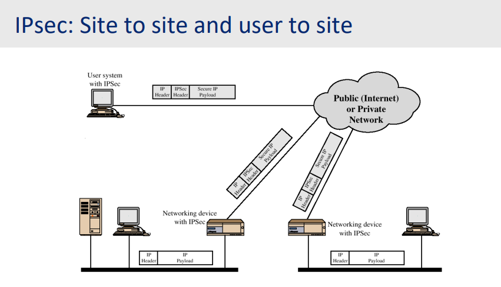
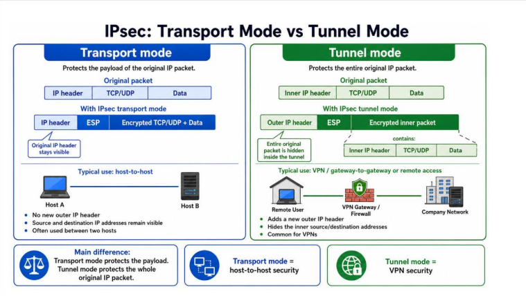
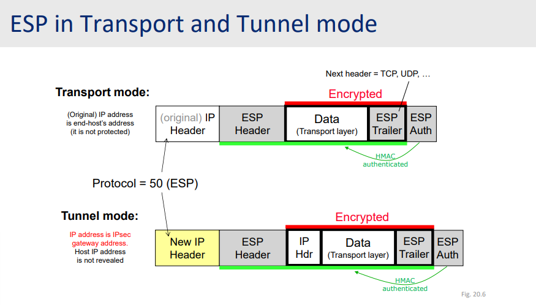
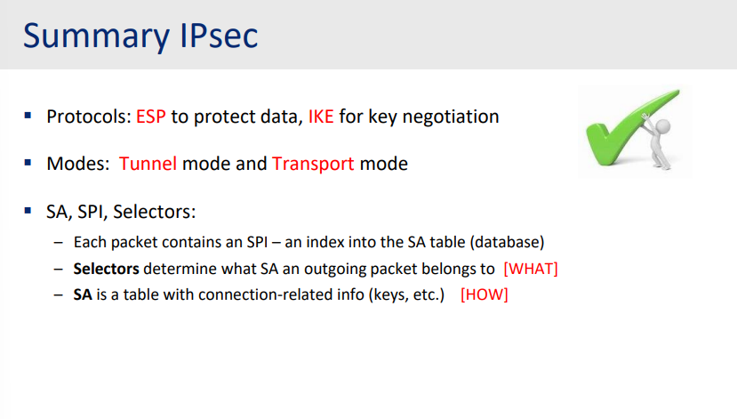

# IPsec - Encrypted and secure IP

>[! Why?]
>Overview for this mechanism: one protocol for encryption, encapsulation security payload with two operating modes: Tunnel and Transport Mode. Also contains an Internet Key Exchange Protocol (ESP and IKE).

## Simplified for IPsec

### What?

IPsec stands for Internet Protocol Security

### How?

Securing IP packets with encryption, integrity and authentication.

### Where?

Mainly in VPN - Virtual Private Network.

### Components?

IKE - Internet Key Exchange
ESP - Encapsulation Secure Payload
AH - Authentication

IPsec, as it name, operates in the layer 3 - Network layer, just one level higher than data link and one level lower than transport.

Real use-case: IPsec tunnel from remote machine of any employee to the VPN gateway, hence granted the accessibility to the cooporate's infrastructure.

There are two modes:

- Transport mode: protects the payload between hosts.
- Tunnel mode: encapsulates and protects the entire original IP packet between gateways/VPN peers.

## Objectives

Surely, a solution that was accepted widely must have several goals, several features that must be met.

**Encryption**:
- At IP level, transparent for transport layer.
- Independent of the network technology.
- An unofficial (not a must, but should be always available) for site-to-site VPN.

**Support**
- Mandatory with IPv6 but optional for IPv4

**Functionalities**
- Access control, message integrity, data origin authenticaiton, rejection of replayed packets, confidentiality.

As illustrated, packet was inserted a small payload called `IPSecHeader`, these packets would be handled specially with device supported IPsec feature.

### Transport mode end-to-end communication

As its name, provide a communication link - securely between two hosts. The most notable example is the remote access connection. But the drawback is, both devices must have IPsec implemented.

### Tunnel mode - site-to-side

Two hosts communicate with each other via two site-networks (that IPsec must be implemented in those machines). But the thing is communication between client and the site network is not secure - typically internal - site - site - another internal. Very common in site-to-site VPN.

As in the transport, it only encrypts the payload, but leaves the IP header exposed. While the tunnel completely encrypts all the data, and an outer IP header was used to hide all original information about that packet. Note that two case, packet always has the Encapsulation Security Payload.

## IPsec protocols: ESP, AH and IKA

### Encapsulating Security Payload

Provides support for data integrity and message confidentiality.

Algorithms can be different in different directions.

Detail in an ESP packet:
- Header: with security parameters index and sequence number, avoid replaying attack.
- Payload data (the actual data).
- Padding data and padding length and next header (to specify the type of packet actually belongs).
- ESP auth.

As in the figure, the confidentiality happened first, the payload, with padding data would be encrypted.

All content, included the header would be hashed to create the integrity stamp.

## Security Associations

Speficy a one-way relationship between sender and receiver. Also, the Security Parameters Index SPI tells under what SA a receiver packet should be processed

