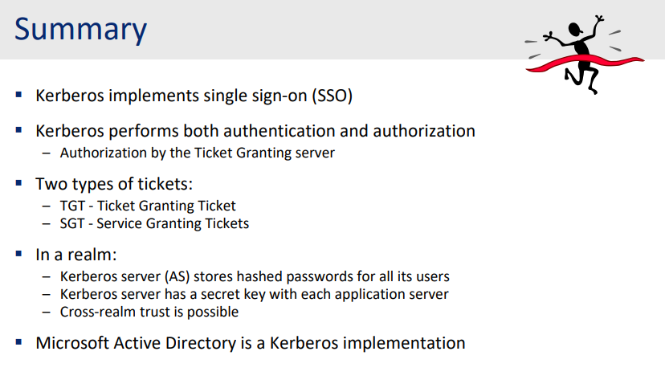

# Remote Authentication with Encryption - Kerberos

## Key distribution with symmetric ciphers

**Public-key** ciphers require computation power and more time-consuming than symmetrical ciphers.

**Symmetrical ciphers** require pairwise shared keys which double the complexity of key sharing - each machine must have the key before exchanging information.

**Key distribution center** - a trusted third party can solve this problem, this narrows down the need for all machine: only 1 key to the KDC.

**Protection** against replays and man-in-the-middle attacks needed. So a nonce - timestamp with number was added to ensure the freshness of the message, also, the timestamp could invalidate old "tickets".

## Kerberos system

**Kerberos server**: contains Key Distribution Center, Authentication Server and Authorization server (this is how components are groupped in the Kerberos, not the actual implementation in real world).

### Authentication step: getting a ticket-granting ticket

User will request a ticket to access to ticket-granting service - which will grant the accessibility to specific service whether the user's authentication information and the ticket are valid or not.

User made request to Kerberos server (Authentication), would be returned a response: ticket granting ticket - encrypted, only can be decrypted by the KDC (keep state, proof of authenticated user) and a network login key (a session key, used for further communication with ticket granting service).

#### Which was transferred throughout the process?

The user will send: Identification, Wanted service's ID and a timestamp.

Then the authentication service will return 2 things (if the user is a valid one), and all data was encrypted, only service from Kerberos can read:
- A session key for communicating with other services in Kerberos eco system, with the ID of requested service (provided by user earlier), a lifetime for that key and a ticket-granting ticket (entrance ticket).
- The entrance ticket contains the key as well, also the information about the requester (ID, address) and same lifetime as the session key - encrypted in a way that only KDC can read.

*Note that every messages in the Kerberos always contain timestamp to indicate the freshness*

#### Master key and passwords

We know that master key is a key used to devirate all sub-keys in the process. In this scenario, master key $K_a$ is a hash of the user's password.

Properties:
- Long term secret.
- The reply from Authentication Service is encrypted with master key.
- Master key should be used as little as possible.
- Only correct user (correct password) can decrypt the response (to get the session key and encrypted version of the ticket).

A Kerberos server can contact other servers to verify username and password (different microservice). Also, in the ticket, all needed information are packed (ID, address, ID of service,...).

### Authentication step: getting a service granting ticket

This ticket will allow user to access to the requested service.

User will send both the ticket granting ticket (received earlier) and authenticator (contain information of user and also timestamp to ensure freshness).

If successfull, the Authorization will return a session key (for communicating between user and requested service) and a Service Granting Ticket (also encrypted, only service can read).

#### Anatomy

User will send the ID, address, all encrypted with the session key got from previous step (provided by Authorizer in the ticket granting ticket).

Return will contains:
- ID of the requested service.
- A ticket and a key to communicate with that service. As same as before, the user can decrypt and see the encrypted form of the ticket. Also got the key to communicate with the service. 

