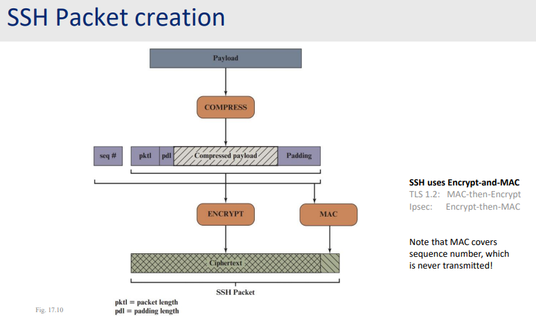
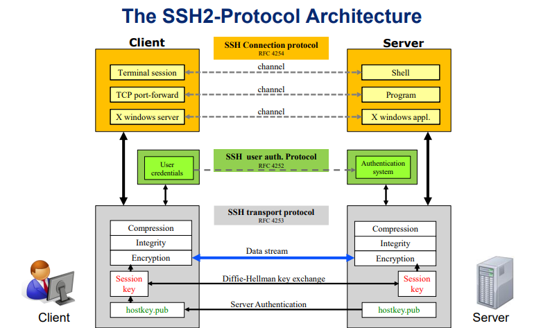
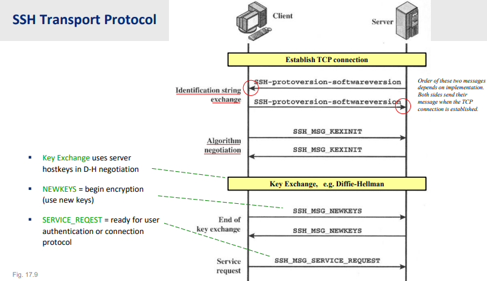

# Secure Shell Protocol and Implementation

>[! Facts]
>`SSH` or Secure Shell is a protocol but also an implementation with the same name. Created by a student from Univeristy of Helsinki, Finland. Operates at application layer, and uses default `TCP` port of 22 (but it is recommended to change this default port to avoid port scanning attack, or at least to harden your system from unauthorized access). 

## A replacement when security is a must, not a bonus 

Before `SSH`, there are `telnet`, `rsh` and `rlogin` - methods to control, access remotely. But with the development of this new tools, there are several superior features that built the backbone of system operation and system administrate:

- A secure terminal: command-line access to remote systems (which include: servers, routers, even firewalls,...).
- Allows servers to be identified with a public key infrastructure system (called host key in this scenario).
- Can also multiplex `TCP` traffic from application - port forwarding.

**Mostly used between trusted systems (servers that trust each other)**

## Packet creation

All the payload (username, password, even details about access address, source address) will be compresed first.

Then it will be inserted between a padding payload (to match the supported size) and also supported by 2 variables: `pklt` and `pdl`- indicate the actual length of the payload and the padding length (for easier unpacking process).

As in `TCP`, sequence number `seq #` is critical to prevent the relay attack and even man-in-the-middle (of course, reduce, but cannot fully get rid of these things), so as a natural, `SSH` packet also contains this property. But different with normal packet, this number is added to the above payload as:

$$
seq\# || pklt || pdl || compressed(payload) || padding
$$

All these properties will be hashed by the `MAC` (or called `HMAC`) message authorized controller - to create the signature, preserving data integrity.

But, the interesting is, sequence number was never sent with the payload, it only was covered by the `MAC`. Otherwise, every properties, execept sequence number will be encrypted, with a little `MAC` at tail to form the packet:

$$
Encrypted(pktl, pdl, compressed(payload)) || HMAC(seq\#, pktl, pdl, compressed(payload))
$$

## Authentication in Secure Shell

**Server host keys**
- Default: must be at least **2048-bit** length - with `RSA` recommended (but now several providers such as Amazon, suggested that should be used `ED25519`).

- Clients maintain a table with entry: hostname -- public host key.

- Public keys must be distributed to client, and should be transferred offline to avoid man in the middle attack.

**Support wide user authentication methods**

- Password, `secureID`, token cards, ...

- Clients can also use public/private key to authorize.

- Also support two-factor authentication (password + one-time-password).

**Implementations support certificates - own format**

- CA signs the keys for a user or a server - but needed to be create first.

- The public key is spread and used to authenticate the user or the server.

- The CA structure must be self-built first.

## Selecting algorithms

**Algorithms and ciphers**

- Same as in the `TLS`, must be negotiated at connection time, for each direction, the set of algorithms may be different.

- Similarity, each party sent the full set of supported algorithms, ciphers in the prioritized order.

- Server will choose the first supported algorithm in the client list.

- Normally, the `EC or D-H` will be used for key exchange.

As shown in the image, there are clearly 3 layers:

- **Connection protocol** - operates at application layer with session, port forward and application,... which provides user an interface.

- **User auth protocol** - not quite a layer, but the first layer since user must authenticate before communicating.

- **Transport protocol** - all the payload compressing, hashing, happen here. For each session, also a new key should be generated using key exchange algorithm (Differ-Hellman).

As in the illustration, the establish phase will be marked with the end of an agreement on which cipher/algorithm to choose.

Key exchange requires the host key, then a new session key will be created, exchange these keys and begin the user authentication (to login, different with the host-client indentification).

## Summary

**`SSH` is a good way** to secure existing applications without having them rewritten. In comparison, `SSL` requires the application to be re-implemented (since there are some functions, some libraries must be used,...).

**Three protocols** transport, user authentication and connection protocol.

**Host keys** - stored in `./ssh/known_hosts` in plain text (or very weak protected mechanism) - must secure the accessibility of the home directory.

**Can tunnel** traffic to another place.

