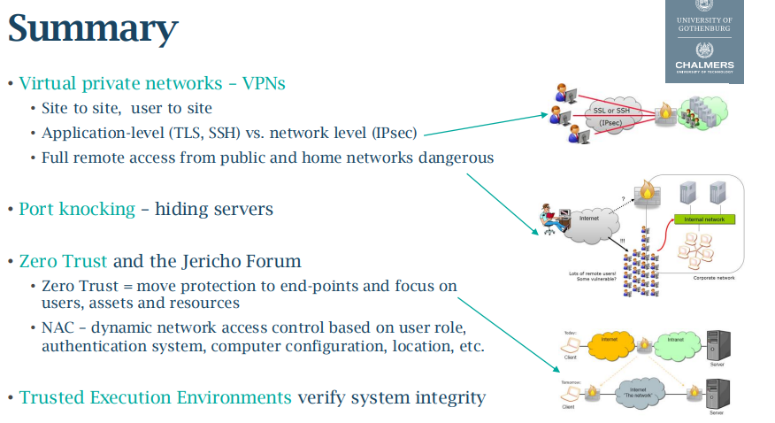

# Forewords

In modern network systems, it is very common to see some kind of tunnel, or at least, the term `VPN` is used frequently. One of the notably example is the `eduVPN` used in Chalmers, mandatory to access Chalmers' infrastructures if not originating from a computer within Chalmers' native networks (laboratories, libraries,...).

## Virtual Private Network, and why?

Check the [[IPsec]], the foundation of Virtual Private Network, the underlying theories, concepts, and everything need to know first.

There are two famous use-cases:
- **Site-to-site Virtual Private Network**: an implementation where the `IPsec` was executed in tunnel mode between sites. The users from both side have the transparent access to both sites. The connection between these two was made through the Internet.

- **User-to-site Virtual Private Network**: some methods like `TLS`, `SSH`, `IPSec` are used. Users can access a corporate network via these mentioned tools. Can control the accessibility for users (limit the risk of a user access sensitive systems without permission).

### VPN option is available at different layers

**Layer 3: IPsec**: transparent to application, full IP tunneling. But of course, two parties needed to agree on this first, and sometime blocked by firewalls.

**Layer 7: `TLS` and `SSH`**: web friendly, traverses firewall on port 443. But less transparent, must be configure differently with each application.

>[! Takeaway]
>Additional software can give `SSH` and `TLS` similar functionality as IPsec.

## Virtual Interfaces enable the IP tunneling

As about the Virtual component (check the similar in the Virtual LAN in the [[Link Layer Security]]), it can allow the flexibility and some features that the physical layers can not achieve easily.

For example, with the Virtual Interface, it can support the `SSH VPN`, which means a packet will be packed, then forwarded to `VPN` for encryption then between 2 machines, a `SSH` tunnel would be created to transport these encrypted packets.

But of course, everything related to virtual components needs administrative privileges.

## Threat with this approach

Since the tunnel with `VPN` allow (by placing the users inside the network), so the firewall has no effect at all.

A compromised remote user can easily become an insider attacker.

## Secure the `VPN` connection

### Layered security control

- Select **standards-based `VPN`** solutions: IPsec, WireGuard, TLS,...
- Enforce **strong authentication**.
- Restrict **segment access**: never grant full network access through `VPN`, also use `VLAN` and protect ports to isolate `VPN` users from internal segments.
- Patch, log sessions and alert if there is any abnormal traffic.

### Placement of `VPN` server determines security capability

In a network topology, the position of a server can affect greatly to its security ability, not only to that machine but also for the whole system.

**VPN behind firewall** is a common setup:
- Provide secure tunnel from user to `VPN` server, since the firewall can inspect the traffic before it was packed by the `VPN`.
- But since the server itself is not a part of firewall, there is still risk of being compromised.

**User authentication and authorization** are done by the `VPN` servers (commonly) but as stated above, a compromised `VPN` server is a disaster.

**`VPN` server can be located in DMZ zone**:
- Compromised server, at least the cleartext `VPN` traffic to the internal network can be captured.
- Should separate traffic between servers in the DMZ (for better trace).

