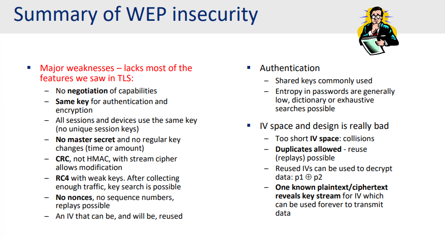
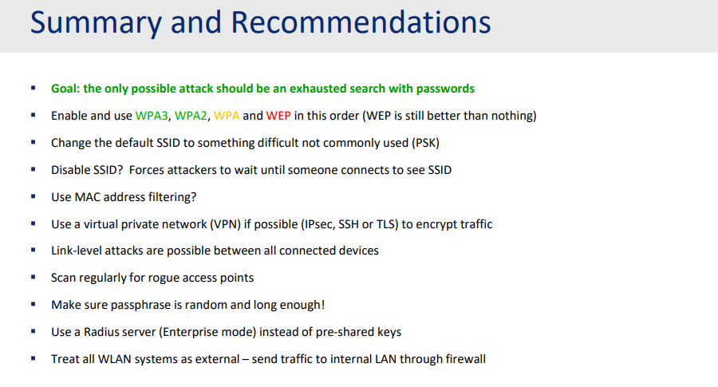

# Wireless Local Area Network (WLAN) security IEEE 802.11

## The 802.11 standard

IEEE standard in 1997 but extensions constantly arrive, mainly in four areas:
- Performance
- Functionality
- Security
- Usability

Each extension has its own suffix:
- 802.11a, 802.11b, 802.11g, 802.11n, 802.11ac, 802.11ax, 802.11be,... (modulation, frequencies different...).
- 802.11i for enhanced security (defines WPA and WPA2).
- 802.11r for secure and fast handover between APs (roaming).
...

## Modes of operation

There are two modes of operation:
- Ad-hoc mode: computes talk directly to each other.
- Infrastructure mode: traffic goes through an access point (AP), most common, clients must form an association with the access point, protected with secure mechanisms: WEP, WPA, WPA2 and WPA3.

## Security scope

Connection from a client machine to the Access Point has protection (WEP, WPA,...) but the connection from the Access Point to the Ethernet (a Switch or an AAA server) has no security at all.

### Basic security

**Client must know the SSID to connect**. It is quite easy with broadcast access points, since just choose the one that is "legitimate and familiar". But some hidden access points as well. Just have one common name "Hidden Network". Only reveals after successfully connected to it. A little hard to discover the network, but otherwise, the same with basic access points.

**MAC address can be used as a filter** to only accept specific devices. Easy to be spoofed, hardly to do in the large environment (in which the number of devices can be hundreds or thousands).

**WEP - Wired Equivalent Privacy** designed to ensure confidentiality, access control and data integrity, but the algorithms and implementation were done by cryptographic amateurs.

**WPA, WPA2, WPA3** - newer security standards, but WPA should only be used during a transition period.

## WEP - Wired Equivalent Privacy

### Client Authentication

- Open system authentication, default, a NULL process, wide open even if the WEP enabled.

- Shared key authentication (WEP), since it is shared, all devices have the same session key. Client sends the authentication request to Access Point, receives a challenge with 128-bytes- Then client will use the answer, initial vector and a shared secret, encrypted it with RC4, and send back to server.

### Dictionary attack

Since the password from the WEP was used  to generate a shared key, and only used it with a small passphrases (5-9 characters) with MD5 hash, if both the clear text and cipher text are known, even further supported by [[Rainbow table]]

WPA2 can do better by using 4096 hash rounds, also, the Rainbow table can be used in this attack, so the best advise is using an uncommon name for access point.

